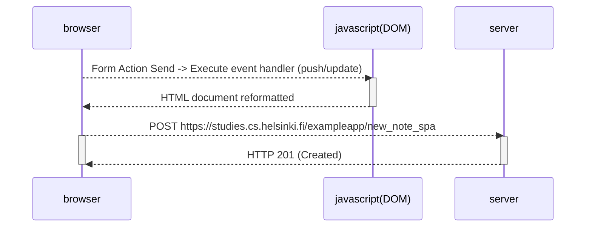

## Diagram flow for a New Note

```mermaid
sequenceDiagram
    participant browser
    participant javascript(DOM)
    participant server

    browser-->>javascript(DOM): Form Action Send -> Execute event handler (push/update)
    activate javascript(DOM)
    javascript(DOM)-->>browser: HTML document reformatted
    deactivate javascript(DOM)

    browser-->>server: POST https://studies.cs.helsinki.fi/exampleapp/new_note_spa
    activate browser
    activate server
    server-->>browser: HTTP 201 (Created)
    deactivate browser
    deactivate server
```